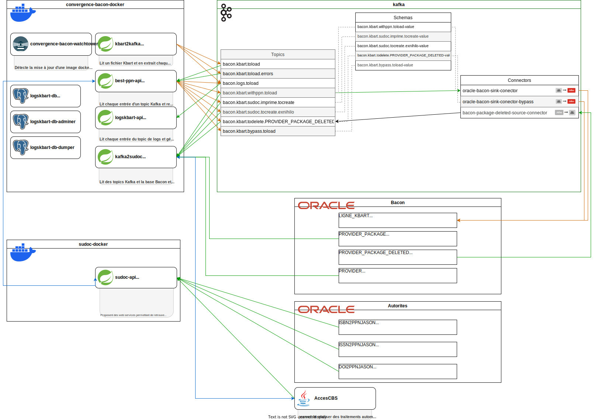

# best-ppn-api

Le langage utilisé est Java, avec le framework Spring.

API permettant de :
1. lire des lignes kbart à partir d'un topic Kafka (alimenté par l'API kbart2kafka [lien github](https://github.com/abes-esr/kbart2kafka))
2. calculer le best ppn pour chaque ligne et de l'inscrire sur la ligne en cours de traitement
3. d'envoyer les lignes vers de nouveaux topics pour traitement ultérieur (insertion dans la base de Bacon, mise à jour de notices dans le Sudoc)
4. d'exposer un ws permettant de calculer le best ppn pour une ligne kafka donnée.

Le fonctionnement de cette API suppose la disponibilité d'un broker Kafka.

## Schéma de l'architecture du projet Convergence


## Lire des lignes kbart
*(class `TopicConsumer.java`)*

La classe `TopicConsumer.java` instancie :
- une `Map<String, KafkaWorkInProgress>`. Au cours du traitement d'une ligne dans `kbartFromkafkaListener()`
- un `ExecutorService` est instancié puis initialisé dans :
```java
@PostConstruct
void initExecutor() {executor = Executors.newFixedThreadPool(nbThread);}
```

>[!NOTE] 
> 
> Le `kbartFromkafkaListener()` lit le topic `bacon.kbart.toload`. Celui-ci dispose de plusieurs partitions (nombre défini par la variable `spring.kafka.concurrency.nbThread` dans les les fichiers application-dev.properties, application-test.properties, application-prod.properties, application-localhost.properties)

>[!IMPORTANT] 
> 
> La valeur de la variable `spring.kafka.concurrency.nbThread` doit être équivalente au nombre de thread du topic `bacon.kbart.toload`.


La classe `TopicConsumer.java` comporte deux `@KafkaListener` qui ont les rôles suivants :
1. `kbartFromkafkaListener()` :
   - un objet `KafkaWorkInProgress` sera créé et placé dans la `Map<String, KafkaWorkInProgress>` pour chaque nouveau nom de fichier kbart détecté à la lecture des messages dans le topic kafka `bacon.kbart.toload`
   - lit les messages kafka à partir du topic `bacon.kbart.toload` (chaque message correspond à une ligne d'un fichier kbart lu par l'API [kbart2kafka](https://github.com/abes-esr/kbart2kafka))
     >[!NOTE] 
     > 
     > Le nom du fichier kbart se trouve dans la `key` du message. Le numéro de la ligne courante `nbCurrentLines` ainsi que le nombre de ligne total du fichier kbart `nbLinesTotal` sont passés dans le header du message
   - demande le calcul du best ppn pour chaque ligne. Le calcul du best ppn sera ignoré si le nom du fichier comporte la chaine de caractère `_BYPASS`
   - demande l'envoi des lignes vers de nouveaux topics
   - gère les actions consécutives aux erreurs relevées durant le traitement d'une ligne. Certaines erreurs seront ignorées si le nom du fichier comporte la chaine de caractère `_FORCE`
3. `errorsListener()` :
   - lit les erreurs de traitement générées par l'API [kbart2kafka](https://github.com/abes-esr/kbart2kafka) lors de la lecture d'un fichier kbart

## Calcul du best ppn
*(class `BestPpnService.java`)*

Cette classe comporte l'algorithme qui récupère les ppn correspondants aux informations contenues dans une ligne kbart.
Cette recherche de ppn(s) fait appel à des web services de l'API sudoc-api ([lien github](https://github.com/abes-esr/sudoc-api?tab=readme-ov-file)) et s'effectue selon cet ordre et ces critères :
1. via le `OnlineIdentifier` s'il est présent
2. via le `PrintIndentifier` s'il est présent
3. via le `TitleUrl` s'il est présent
4. via le `DAT` (Date-Auteur-Titre) si les trois recherches précédentes n'ont données aucun résultat
En fonction du web service utilisé, du type de support et du nombre de ppn, un score est attribué à chaque ppn.

Après la recherche de ppn(s) terminée, la sélection du best ppn est réalisée via la méthode `getBestPpnByScore()`. Cette méthode détermine également le topic de destination.
- Si aucun ppn n'a été trouvé, le bestPpn est mis à `null` et le topic de destination est `DESTINATION_TOPIC.NO_PPN_FOUND_SUDOC`
- Si un ppn imprimé a été trouvé, la ligne kbart correspondante est agrémentée du ppn et le topic de destination est `DESTINATION_TOPIC.PRINT_PPN_SUDOC`
- Si un ppn électronique a été trouvé, la ligne kbart correspondante est agrémentée du ppn et le topic de destination est `DESTINATION_TOPIC.BEST_PPN_BACON`
- Si plus de deux ppn imprimés ont été trouvés : 
  - si le nom du fichier comporte `_FORCE`, le bestPpn est mis à `""` et le topic de destination est `DESTINATION_TOPIC.BEST_PPN_BACON`
  - sinon une exception est levée
- Si plusieurs ppn électroniques ont le même score :
  - si le nom du fichier comporte `_FORCE`, le bestPpn est mis à `""` et le topic de destination est `DESTINATION_TOPIC.BEST_PPN_BACON`
  - sinon une exception est levée

## Envoie des lignes vers de nouveaux topics
*(class `KbartService.java`)*

- si `DESTINATION_TOPIC.NO_PPN_FOUND_SUDOC` : 
  - si `publication_type` est `monograph`, alors la ligne kbart correspondante est envoyée dans le topic `bacon.kbart.sudoc.tocreate.exnihilo` pour traitement ultérieur par l'API [kafka2sudoc](https://github.com/abes-esr/kafka2sudoc)
  - sinon la ligne kbart correspondante est envoyée dans le topic `bacon.kbart.withppn.toload` pour traitement ultérieur par l'API [kafka2sudoc](https://github.com/abes-esr/kafka2sudoc)
- si `DESTINATION_TOPIC.PRINT_PPN_SUDOC` :
  - si `publication_type` est `monograph`, alors la ligne kbart correspondante est envoyée dans le topic `bacon.kbart.sudoc.imprime.tocreate` pour traitement ultérieur par l'API [kafka2sudoc](https://github.com/abes-esr/kafka2sudoc)
  - sinon la ligne kbart correspondante est envoyée dans le topic `bacon.kbart.withppn.toload` pour traitement ultérieur par l'API [kafka2sudoc](https://github.com/abes-esr/kafka2sudoc)
- si `DESTINATION_TOPIC.BEST_PPN_BACON`, alors la ligne kbart correspondante est envoyée dans le topic `bacon.kbart.withppn.toload` pour traitement ultérieur par l'API [kafka2sudoc](https://github.com/abes-esr/kafka2sudoc)


*(class `TopicProducer.java`)*
Centralise les différents `KafkaTemplate` et envoi des lignes kbart dans les topic dédiés.

## Web Sevice 'bestPpn'
*(class `BestPpnController.java`)*

Voir le [README.md](README.md) pour le fonctionnement général.

Lors de l'appel à la méthode `getBestPpn()`, le paramètre `injectKafka` (correspond au paramètre `_FORCE` dans le nom de fichier) est passé automatiquement à `true`.

## Génération de l'image docker
Vous pouvez avoir besoin de générer en local l'image docker de `best-ppn-api` par exemple si vous cherchez à modifier des liens entre les conteneurs docker de l'application.

Pour générer l'image docker de `best-ppn-api` en local voici la commande à lancer :
```bash
cd best-ppn-api/
docker build -t abesesr/convergence:develop-best-ppn-api .
```

Cette commande aura pour effet de générer une image docker sur votre poste en local avec le tag `develop-best-ppn-api`. Vous pouvez alors déployer l'application en local avec docker en vous utilisant sur le Github [convergence-bacon-docker](https://github.com/abes-esr/convergence-bacon-docker) et en prenant soins de régler la variable `BESTPPNAPI_VERSION` sur la valeur `develop-best-ppn-api` dans le fichier ``.env`` de votre déploiement [``convergence-bacon-docker``](https://github.com/abes-esr/convergence-bacon-docker) ([modèle fichier .env-dist](https://github.com/abes-esr/convergence-bacon-docker/blob/bdcd4302131eb86688ae729b0fc016d128f1ab9c/.env-dist#L9)).

Vous pouvez utiliser la même procédure pour générer en local les autres images docker applications composant l'architecture, la seule chose qui changera sera le nom du tag docker.

Cette commande suppose que vous disposez d'un environnement Docker en local : cf la [FAQ dans la poldev](https://github.com/abes-esr/abes-politique-developpement/blob/main/10-FAQ.md#configuration-dun-environnement-docker-sous-windows-10).

## Schema registry et gestion des versions de schéma
### Schema registry
Pour pouvoir utiliser le schema registry, il est nécessaire de l'installer avec Kafka. Voir le projet Github [bacon-kafka-docker](https://github.com/abes-esr/bacon-kafka-docker)

### Création du schéma
Les éléments composant les topics dans Kafka sont des objets de type ligne Kbart. Ils sont envoyés à kafka, en utilisant un serializer de type KafkaAvroSerializer. Pour permettre aux programmes Java et à Kafka de pouvoir dialoguer et de mapper correctement les données, il est nécessaire de créer un schéma représentant l'objet à envoyer. Pour cela : 
- dans best-ppn-api : dans le répertoire src/resources/avro se trouve un fichier ligne_kbart_convergence.avsc décrivant un record de ligne kbart en avro
- Il est nécessaire de générer la classe java correspondant à ce schéma via le goal maven generate-sources (mvn generate-sources).
- Le schéma doit ensuite être copié dans le schéma registry de Kafka pour que Kafka soit en mesure d'interpréter l'objet reçu dans le schéma
- Attention ! le fichier avro contient un numéro de version du schéma, il est indispensable que la classe java, et le schéma enregistré dans le schema registry aient le même numéro de version.
- le même schéma doit être utilisé dans toutes les sources de données qui liront le / les topics kafka contenant des objets de type ligneKbart.

Pour plus d'informations sur le format Avro : cliquer [ici](https://avro.apache.org/)

